### MAG-Edit: Localized Image Editing in Complex Scenarios via Mask-Based Attention-Adjusted Guidance  

This repository is the official implementation of MAG-Edit.

[Qi Mao](https://sites.google.com/view/qi-mao/), [Lan Chen](), [Yuchao Gu](https://ycgu.site/), [Zhen Fang](), [Mike Zheng Shou](https://sites.google.com/view/showlab)


[](https://orannue.github.io/MAG-Edit/)
[]()

<p align="center">
  
<br>
<em> (a) <a href="https://github.com/omriav/blended-latent-diffusion">Blended latent diffusion</a>  (b) <a href="https://arxiv.org/abs/2210.11427">DiffEdit</a>  (c) <a href="https://github.com/google/prompt-to-prompt">Prompt2Prompt</a> <br> 
(d)  <a href="https://github.com/MichalGeyer/plug-and-play">Plug-and-play</a>  (e) P2P+Blend (f) PnP+Blend</em>
</p>

## :bookmark: Abstract
<b>TL; DR: <font color="red">MAG-Edit</font> first method specifically designed to
address localized image editing in complex scenarios without training.</b>

<details><summary>CLICK for the full abstract</summary>
Recent diffusion-based image editing approaches have exhibited impressive editing capabilities in images with simple compositions. However, localized editing in complex scenarios has not been well-studied in the literature, despite its growing real-world demands. Existing mask-based inpainting methods fall short of retaining the underlying structure within the edit region. Meanwhile, mask-free attention-based methods often exhibit editing leakage and misalignment in more complex compositions. In this work, we develop MAG-Edit, a training-free, inference-stage optimization method, which enables localized image editing in complex scenarios. In particular, MAG-Edit optimizes the noise latent feature in diffusion models by maximizing two mask-based cross-attention constraints of the edit token, which in turn gradually enhances the local alignment with the desired prompt. Extensive quantitative and qualitative experiments demonstrate the effectiveness of our method in achieving both text alignment and structure preservation for localized editing within complex scenarios.
</details>

## :pencil: Changelog
- 2023.12.19 Release Project Page and Paper!
## :date: TODO:

- [ ] Release Code
- [x] Release MAG-Edit paper and project page


<p align="center">
<h2> Various Editing Types </h2>
<p align="center">
  
</p>

<h2> Other Applications</h2>  
<p align="center">
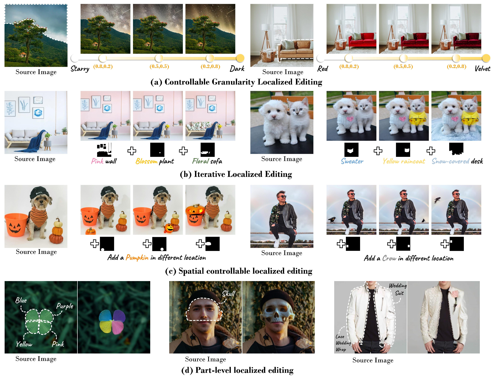  
<br>

<h2> Qualitative Comparison </h2>
compare with training-free methods
<p align="center">
  <table align="center"   style="text-align:center;">
    <tr style="background-color: #F5F5F5">
      <td align="center">
       Simplified <br>Prompt
      </td>
      <td align="center">
       Source Image
      </td>
      <td  align="center">
        <b>MAG-Edit(Ours)</b>
      </td>
      <td align="center">
       <a href="https://github.com/omriav/blended-latent-diffusion">Blended LD</a>
      </td>
      <td  align="center">
      <a href="https://arxiv.org/abs/2210.11427">DiffEdit</a>
      </td>
      <td  align="center">
      <a herf="https://github.com/google/prompt-to-prompt">P2P</a>
      </td>
      <td  align="center">
      <a herf="https://github.com/MichalGeyer/plug-and-play">PnP</a>
      </td>
    </tr>
    <tr>
      <td style="padding:0;" align="center">
        Green <br>pillow
      </td>
      <td style="width: 90px; height:90px;padding:0;" align="center">
        
      </td>
      <td style="width:90px; height: 90px;padding:0;" align="center">
        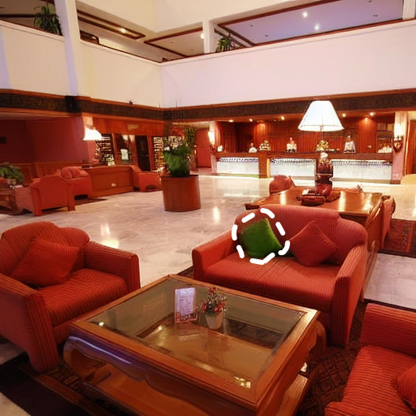
      </td>
      <td style="width: 90px; height: 90px;padding:0;" align="center">
        
      </td>          
      <td style="width: 90px; height: 90px;padding:0;" align="center">
        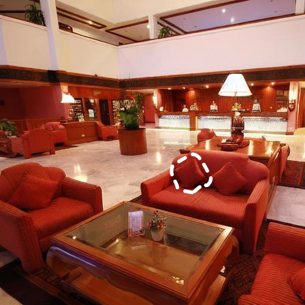
      </td>
      <td style="width: 90px; height: 90px;padding:0;" align="center">
        
      </td>      
      <td style="width: 90px; height: 90px;padding:0;" align="center">
        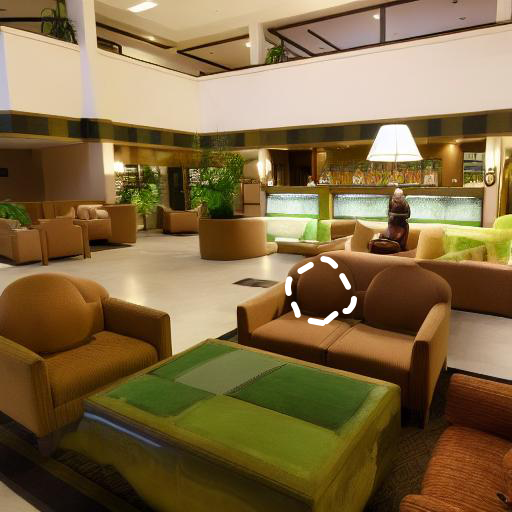
      </td>     
    </tr>
    <tr>
      <td style="padding:0;" align="center">
        Denim <br>pants
      </td>
      <td style="width: 90px; height:90px;padding:0;" align="center">
        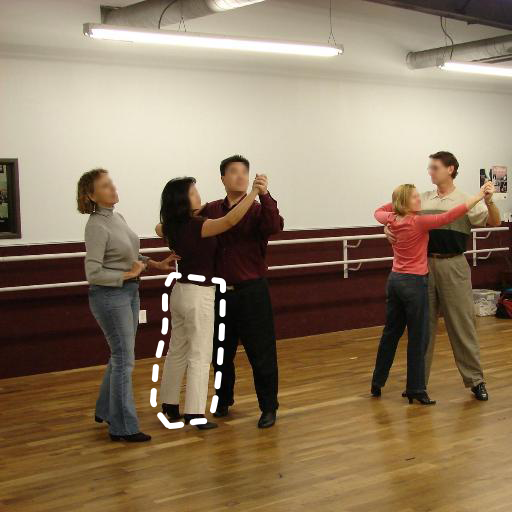
      </td>
      <td style="width:90px; height: 90px;padding:0;" align="center">
        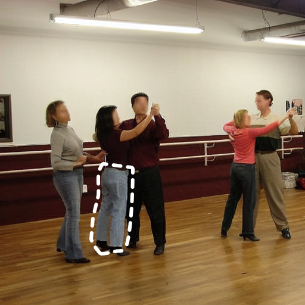
      </td>
      <td style="width: 90px; height: 90px;padding:0;" align="center">
        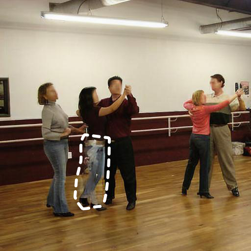
      </td>          
      <td style="width: 90px; height: 90px;padding:0;" align="center">
        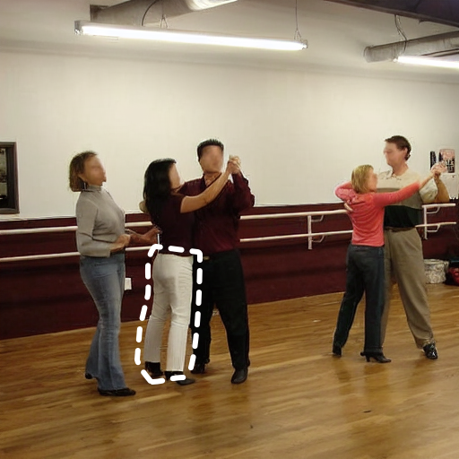
      </td>
      <td style="width: 90px; height: 90px;padding:0;" align="center">
        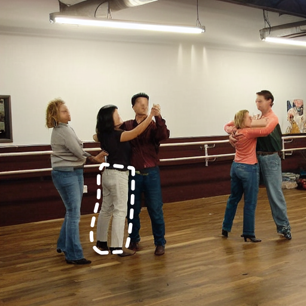
      </td>      
      <td style="width: 90px; height: 90px;padding:0;" align="center">
        
      </td>     
    </tr>
    <tr>
      <td style="padding:0;" align="center">
        White <br>bird
      </td>
      <td style="width: 90px; height:90px;padding:0;" align="center">
        
      </td>
      <td style="width:90px; height: 90px;padding:0;" align="center">
        
      </td>
      <td style="width: 90px; height: 90px;padding:0;" align="center">
        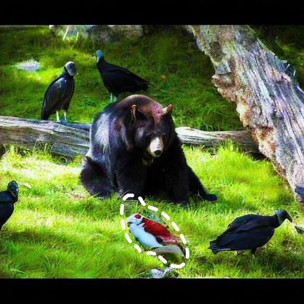
      </td>          
      <td style="width: 90px; height: 90px;padding:0;" align="center">
        
      </td>
      <td style="width: 90px; height: 90px;padding:0;" align="center">
        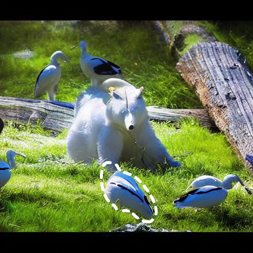
      </td>      
      <td style="width: 90px; height: 90px;padding:0;" align="center">
        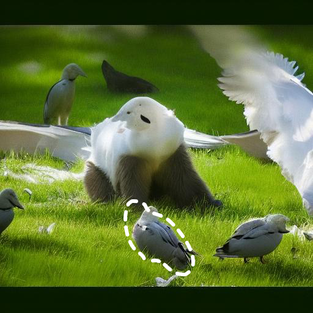
      </td>     
    </tr>
    <tr>
      <td style="padding:0;" align="center">
        Slices of <br>steak
      </td>
      <td style="width: 90px; height:90px;" align="center">
        
      </td>
      <td style="width:90px; height: 90px;" align="center">
        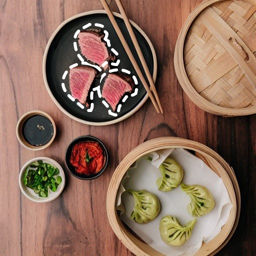
      </td>
      <td style="width: 90px; height: 90px;" align="center">
        
      </td>          
      <td style="width: 90px; height: 90px;" align="center">
        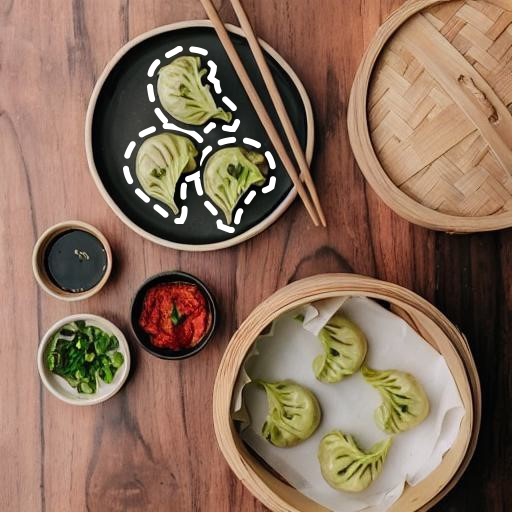
      </td>
      <td style="width: 90px; height: 90px;" align="center">
        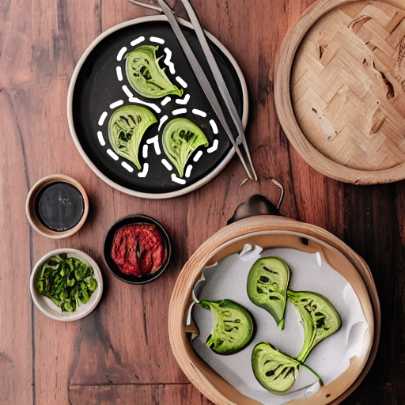
      </td>      
      <td style="width: 90px; height: 90px;" align="center">
        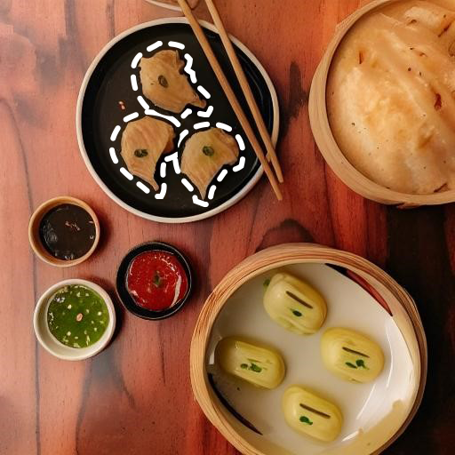
      </td>     

  </table>


<!--
<font size=4>Comparison with <a href="https://github.com/omriav/blended-latent-diffusion">Blended LD</a> and <a href="https://arxiv.org/abs/2210.11427">DiffEdit</a></font>
</p>
<p align="center">
  
</p>
<p align="center">
<font size=4>Comparison with <a href="https://github.com/google/prompt-to-prompt">P2P</a> and <a href="https://github.com/MichalGeyer/plug-and-play">PnP</a></font>
</p>
<p align="center">
  
</p>
<p align="center">
<font size=4>Comparison with <a href="https://github.com/timothybrooks/instruct-pix2pix">InstructPix2Pix</a> and <a href="https://github.com/OSU-NLP-Group/MagicBrush">MagicBrush</a></font>
</p>
<p align="center">
  
</p>
<h3> Various Editing Scenarios </h3>
<p align="center">
  
</p>
-->


## :triangular_flag_on_post: Citation 

```
@article{qi2023MAG-Edit,
      title={MAG-Edit: Localized Image Editing in Complex Scenarios via Mask-Based Attention-Adjusted Guidance  }, 
      author={Qi Mao and Lan Chen and Yuchao Gu and Zhen Fang and Mike Zheng Shou},
      year={2023},
      journal={arXiv:XXXXX},
}
``` 


## :revolving_hearts: Acknowledgements

This repository borrows heavily from [prompt-to-prompt](https://github.com/google/prompt-to-prompt/). Thanks to the authors for sharing their code and models.


