<h1> MAG-Edit </h1>

This repository is the official implementation of MAG-Edit.

MAG-Edit: Localized Image Editing in Complex Scenarios via
Mask-Based Attention-Adjusted Guidance  
 
[Qi Mao](https://sites.google.com/view/qi-mao/),  
[Lan Chen](), 
[Yuchao Gu](https://ycgu.site/), 
[Zhen Fang](),
[Mike Zheng Shou](https://sites.google.com/view/showlab)
 

  
 
<em> (a) <a href="https://github.com/omriav/blended-latent-diffusion">Blended latent diffusion</a>  (b) <a href="https://arxiv.org/abs/2210.11427">DiffEdit</a>  (c) <a href="https://github.com/google/prompt-to-prompt">Prompt2Prompt</a>   
(d)  <a href="https://github.com/MichalGeyer/plug-and-play">Plug-and-play</a>  (e) P2P+Blend (f) PnP+Blend</em>

## TODO:

- [ ] Release Code
- [ ] Release MAG-Edit paper and project page

<h2> Results </h2>

<h3> Various Editing Types </h3>

  

<h3> Other Applications</h3>  

  
 

<h3> Qualitative Comparison </h3>

  <table align="center"   style="text-align:center;">
    <tr style="background-color: #F5F5F5">
      <td align="center">
       Simplified  Prompt
      </td>
      <td align="center">
       Source Image
      </td>
      <td  align="center">
        <b>MAG-Edit(Ours)</b>
      </td>
      <td align="center">
        P2P
      </td>
      <td  align="center">
        PnP
      </td>
    </tr>
    <tr>
      <td style="padding:0;" align="center">
        Green  pillow
      </td>
      <td style="width: 105px; height:105px;padding:0;" align="center">
        
      </td>
      <td style="width:105px; height: 105px;padding:0;" align="center">
        
      </td>
      <td style="width: 105px; height: 105px;padding:0;" align="center">
        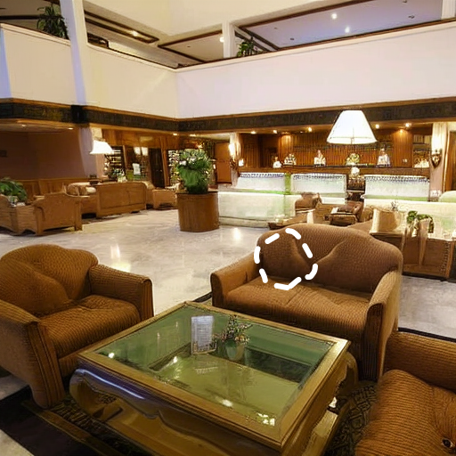
      </td>          
      <td style="width: 105px; height: 105px;padding:0;" align="center">
        
      </td>
    </tr>
      <tr>
      <td style="padding:0;" align="center">
        Denim  pants
      </td>
      <td style="width: 105px; height:105px;padding:0;" align="center">
        
      </td>
      <td style="width:105px; height: 105px;padding:0;" align="center">
        
      </td>
      <td style="width: 105px; height: 105px;padding:0;" align="center">
        
      </td>          
      <td style="width: 105px; height: 105px;padding:0;" align="center">
        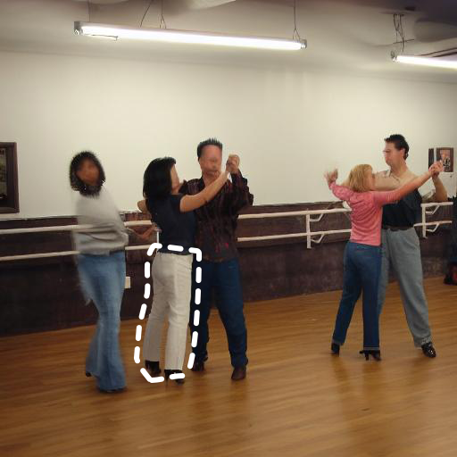
      </td>
    </tr>
      <tr>
      <td style="padding:0;" align="center">
        Vintgae  car
      </td>
      <td style="width: 105px; height:105px;padding:0;" align="center">
        
      </td>
      <td style="width:105px; height: 105px;padding:0;" align="center">
        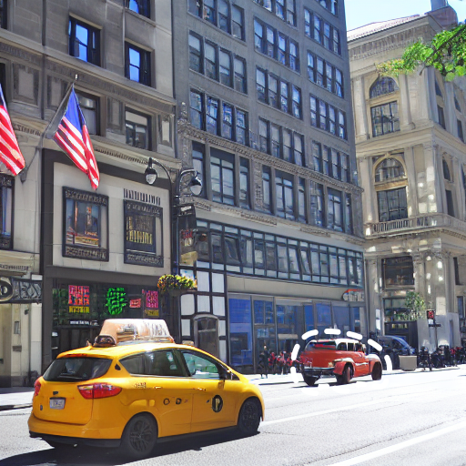
      </td>
      <td style="width: 105px; height: 105px;padding:0;" align="center">
        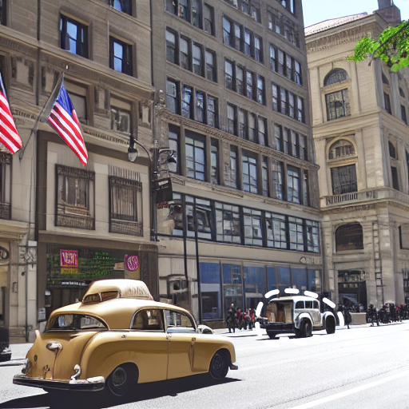
      </td>          
      <td style="width: 105px; height: 105px;padding:0;" align="center">
        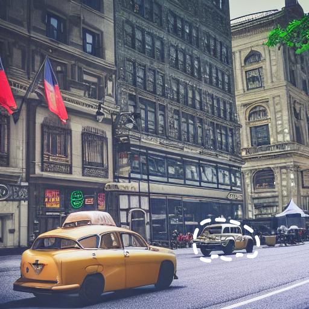
      </td>
    </tr>
      <tr>
      <td style="padding:0;" align="center">
        Slices of  steak
      </td>
      <td style="width: 105px; height:105px;padding:0;" align="center">
        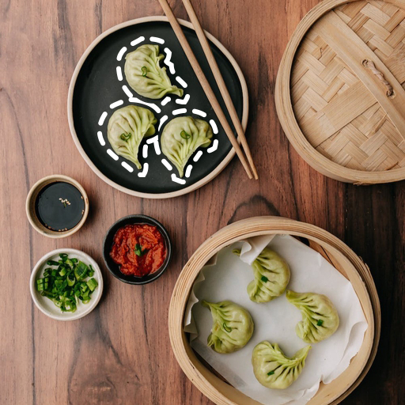
      </td>
      <td style="width:105px; height: 105px;padding:0;" align="center">
        
      </td>
      <td style="width: 105px; height: 105px;padding:0;" align="center">
        
      </td>          
      <td style="width: 105px; height: 105px;padding:0;" align="center">
        
      </td>
    </tr>
    <tr style="background-color: #F5F5F5">
      <td align="center">
       Simplified  Prompt
      </td>
      <td align="center">
       Source Image
      </td>
      <td  align="center">
        <b>MAG-Edit(Ours)</b>
      </td>
      <td align="center">
        Blended Latent Diffusion
      </td>
      <td  align="center">
        DiffEdit
      </td>
    </tr>
    <tr>
      <td style="padding:0;" align="center">
        Yellow  chair
      </td>
      <td style="width: 105px; height:105px;padding:0;" align="center">
        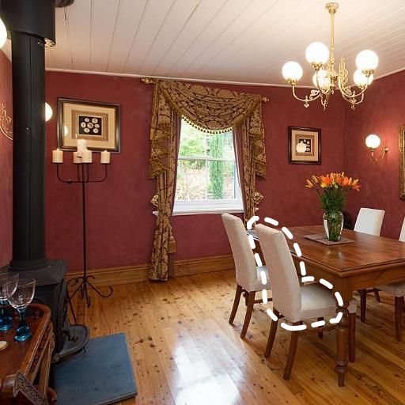
      </td>
      <td style="width:105px; height: 105px;padding:0;" align="center">
        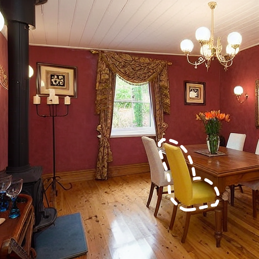
      </td>
      <td style="width: 105px; height: 105px;padding:0;" align="center">
        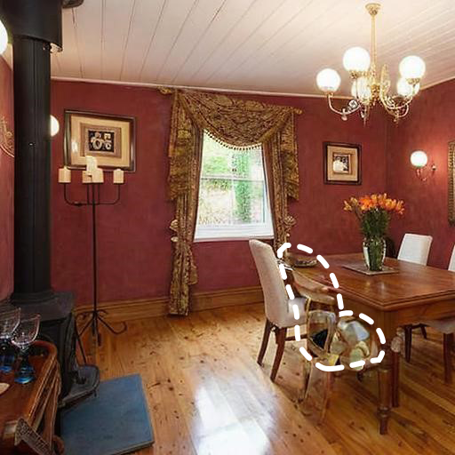
      </td>          
      <td style="width: 105px; height: 105px;padding:0;" align="center">
        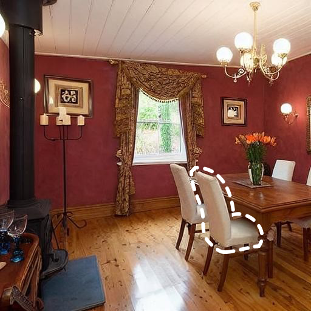
      </td>
    </tr>
      <tr>
      <td style="padding:0;" align="center">
        Plaid  shirt
      </td>
      <td style="width: 105px; height:105px;padding:0;" align="center">
        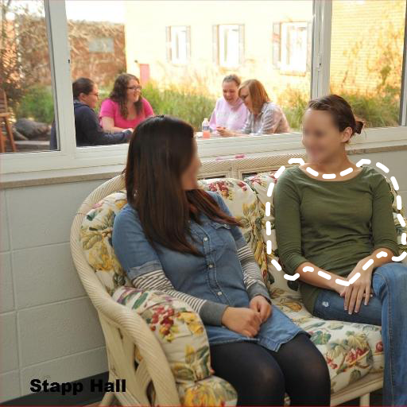
      </td>
      <td style="width:105px; height: 105px;padding:0;" align="center">
        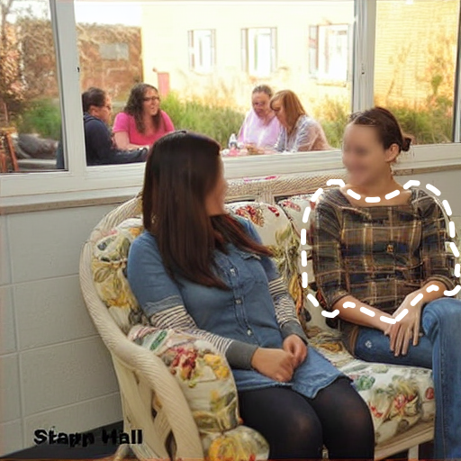
      </td>
      <td style="width: 105px; height: 105px;padding:0;" align="center">
        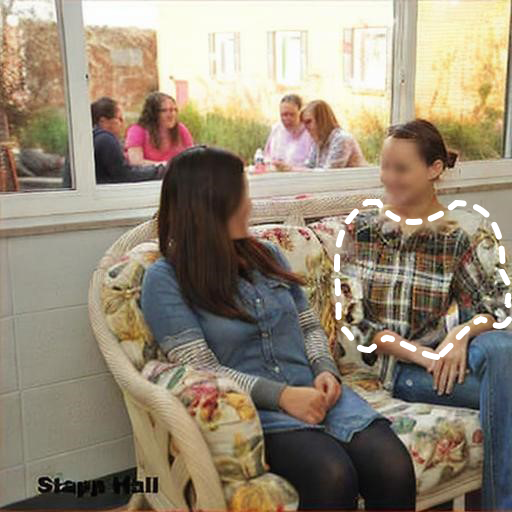
      </td>          
      <td style="width: 105px; height: 105px;padding:0;" align="center">
        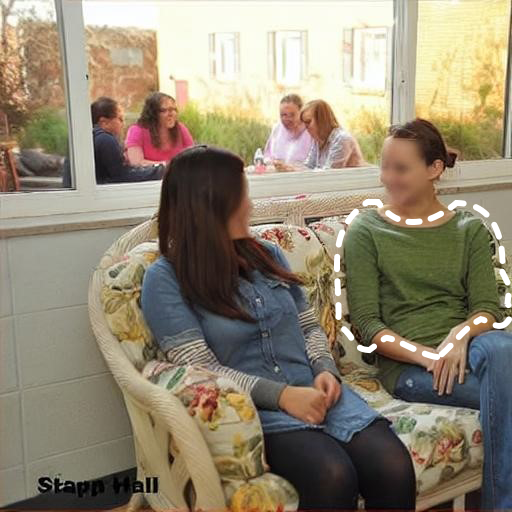
      </td>
    </tr>
      <tr>
      <td style="padding:0;" align="center">
        White  bird
      </td>
      <td style="width: 105px; height:105px;padding:0;" align="center">
        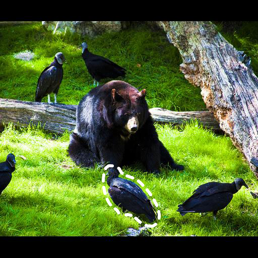
      </td>
      <td style="width:105px; height: 105px;padding:0;" align="center">
        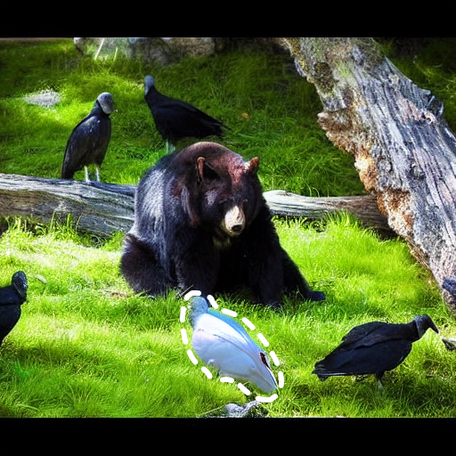
      </td>
      <td style="width: 105px; height: 105px;padding:0;" align="center">
        
      </td>          
      <td style="width: 105px; height: 105px;padding:0;" align="center">
        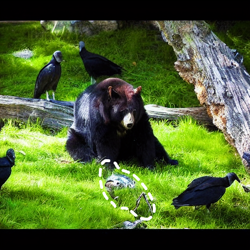
      </td>
    </tr>
      <tr>
         <td style="padding:0;" align="center">
        Strawberry
      </td>
      <td style="width: 105px; height:105px;padding:0;" align="center">
        
      </td>
      <td style="width:105px; height: 105px;padding:0;" align="center">
        
      </td>
      <td style="width: 105px; height: 105px;padding:0;" align="center">
        
      </td>          
      <td style="width: 105px; height: 105px;padding:0;" align="center">
        
      </td>
    </tr> 
    <tr>
      <td align="center" style="background-color: #F5F5F5">
       Simplified  Prompt
      </td>
      <td align="center">
       Source Image
      </td>
      <td  align="center">
        <b>MAG-Edit(Ours)</b>
      </td>
      <td align="center">
        InstructPix2Pix
      </td>
      <td  align="center">
        MagicBrush
      </td>
    </tr>
    <tr>
      <td style="padding:0;" align="center">
        Yellow  chair
      </td>
      <td style="width: 105px; height:105px;padding:0;" align="center">
        
      </td>
      <td style="width:105px; height: 105px;padding:0;" align="center">
        
      </td>
      <td style="width: 105px; height: 105px;padding:0;" align="center">
        
      </td>          
      <td style="width: 105px; height: 105px;padding:0;" align="center">
        
      </td>
    </tr>   
      <tr>
      <td style="padding:0;" align="center">
        Yellow  chair
      </td>
      <td style="width: 105px; height:105px;padding:0;" align="center">
        
      </td>
      <td style="width:105px; height: 105px;padding:0;" align="center">
        
      </td>
      <td style="width: 105px; height: 105px;padding:0;" align="center">
        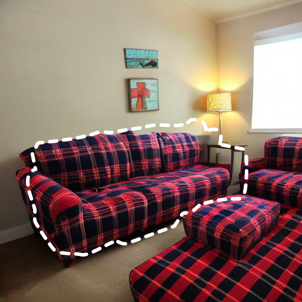
      </td>          
      <td style="width: 105px; height: 105px;padding:0;" align="center">
        
      </td>
    </tr>  
    <tr>
      <td style="padding:0;" align="center">
        Yellow  chair
      </td>
      <td style="width: 105px; height:105px;padding:0;" align="center">
        
      </td>
      <td style="width:105px; height: 105px;padding:0;" align="center">
        
      </td>
      <td style="width: 105px; height: 105px;padding:0;" align="center">
        
      </td>          
      <td style="width: 105px; height: 105px;padding:0;" align="center">
        
      </td>
    </tr>    
  </table>

<!--
Comparison with <a href="https://github.com/omriav/blended-latent-diffusion">Blended LD</a> and <a href="https://arxiv.org/abs/2210.11427">DiffEdit</a>

  

Comparison with <a href="https://github.com/google/prompt-to-prompt">P2P</a> and <a href="https://github.com/MichalGeyer/plug-and-play">PnP</a>

  

Comparison with <a href="https://github.com/timothybrooks/instruct-pix2pix">InstructPix2Pix</a> and <a href="https://github.com/OSU-NLP-Group/MagicBrush">MagicBrush</a>

  

<h3> Various Editing Scenarios </h3>

  

-->

<h2> Citation </h2>

