### MAG-Edit: Localized Image Editing in Complex Scenarios via Mask-Based Attention-Adjusted Guidance  

This repository is the official implementation of MAG-Edit.

[Qi Mao](https://sites.google.com/view/qi-mao/), [Lan Chen](), [Yuchao Gu](https://ycgu.site/), [Zhen Fang](), [Mike Zheng Shou](https://sites.google.com/view/showlab)


[](https://mag-edit.github.io/)
[]()

<p align="center">
  
<br>
<em> (a) <a href="https://github.com/omriav/blended-latent-diffusion">Blended latent diffusion</a>  (b) <a href="https://arxiv.org/abs/2210.11427">DiffEdit</a>  (c) <a href="https://github.com/google/prompt-to-prompt">Prompt2Prompt</a> <br> 
(d)  <a href="https://github.com/MichalGeyer/plug-and-play">Plug-and-play</a>  (e) P2P+Blend (f) PnP+Blend</em>
</p>

## :bookmark: Abstract
<b>TL; DR: <font color="red">MAG-Edit</font> is the first method specifically designed to
address localized image editing in complex scenarios without training.</b>

<details><summary>CLICK for the full abstract</summary>
Recent diffusion-based image editing approaches have exhibited impressive editing capabilities in images with simple compositions. However, localized editing in complex scenarios has not been well-studied in the literature, despite its growing real-world demands. Existing mask-based inpainting methods fall short of retaining the underlying structure within the edit region. Meanwhile, mask-free attention-based methods often exhibit editing leakage and misalignment in more complex compositions. In this work, we develop MAG-Edit, a training-free, inference-stage optimization method, which enables localized image editing in complex scenarios. In particular, MAG-Edit optimizes the noise latent feature in diffusion models by maximizing two mask-based cross-attention constraints of the edit token, which in turn gradually enhances the local alignment with the desired prompt. Extensive quantitative and qualitative experiments demonstrate the effectiveness of our method in achieving both text alignment and structure preservation for localized editing within complex scenarios.
</details>

## :pencil: Changelog
- 2024.05.24 Release Token Ratio Code!
- 2023.12.19 Release Project Page and Paper!
## 💡TODO:
- [] Release Spatial Ratio Code 
- [x] Release Token Ratio Code
- [x] Release MAG-Edit paper and project page
## :video_game: MAG-Edit Implementation
### Preparation
Our method is tested using cuda12.0, fp16 of accelerator and xformers on a single A100 or 3090.
The preparation work mainly includes downloading the pre-trained model and configuring the environment.

```bash
conda create -n mag python=3.8
conda activate mag

pip install -r requirements.txt
```
We mainly conduct expriemnts on Stable Diffusion v1-4.
You can download these checkpoints from [Hugging Face](https://huggingface.co/CompVis/stable-diffusion-v1-4) and move these files to the folder `code_tr/models/sdm-1.4`. 

### Demo
To run MAG-Edit, single GPU with at least 32 GB VRAM is required.
The `code_tr/edit.sh` provide the edit sample.

```bash
CUDA_VISIBLE_DEVICES=0 python edit.py --source_prompt="there is a set of sofas on the red carpet in the living room"\
                --target_prompt="there is a set of sofas on the yellow carpet in the living room" \
                --target_word="yellow" \
                --img_path="/data/home/cl/code_tr/examples/1/1.jpg"\
                --mask_path="/data/home/cl/code_tr/examples/1/mask.png"\
                --result_dir="result"\
                --max_iteration=15\
                --scale=2.5
```
The result is saved at `code_tr/result`.
<p align="center">
<h2> Various Editing Types </h2>
<p align="center">
  
</p>

<h2> Other Applications</h2>  
<p align="center">
  
<br>

<h2> Qualitative Comparison </h2>
<font size=4>Comparison with training-free methods</font>

<p align="center">
  <table align="center"  >
    <tr >
      <td  style="text-align:center;" width=10% >
       Simplified <br>Prompt
      </td>
      <td  style="text-align:center;" width=15%>
       Source <br> Image
      </td>
      <td   style="text-align:center;"  width=15%>
        <b>Ours</b>
      </td>
      <td  style="text-align:center;"  width=15%>
       <a href="https://github.com/omriav/blended-latent-diffusion">Blended LD</a>
      </td>
      <td  style="text-align:center;"  width=15%>
      <a href="https://arxiv.org/abs/2210.11427">DiffEdit</a>
      </td>
      <td  style="text-align:center;"  width=15%>
      <a href="https://github.com/google/prompt-to-prompt/">P2P</a>
      </td>
      <td  style="text-align:center;"  width=15%>
      <a href="https://github.com/MichalGeyer/plug-and-play">PnP</a>
      </td>
    </tr>
    <tr>
      <td   width=10%>
        Green <br>pillow
      </td>
      <td   width=15%>
        
      </td>
      <td  width=15%> 
        
      </td>
      <td   width=15%>
        
      </td>          
      <td  width=15%>
        
      </td>
      <td width=15%>
        
      </td>      
      <td  width=15%>
        
      </td>     
    </tr>
    <tr>
      <td  >
        Denim <br>pants
      </td>
      <td >
        
      </td>
      <td  >
        
      </td>
      <td  >
        
      </td>          
      <td  >
        
      </td>
      <td >
        
      </td>      
      <td >
        
      </td>     
    </tr>
    <tr>
      <td  >
        White <br>bird
      </td>
      <td >
        
      </td>
      <td  >
        
      </td>
      <td  >
        
      </td>          
      <td >
        
      </td>
      <td >
        
      </td>      
      <td>
        
      </td>     
    </tr>
    <tr>
      <td  >
        Slices of <br>steak
      </td>
      <td>
         
      </td>
      <td>
        
      </td>
      <td >
        
      </td>          
      <td  >
        
      </td>
      <td >
        
      </td>      
      <td>
        
      </td>  
    </tr>   
  </table>


<font size=4>Comparison with training and finetuning methods</font>

<p align="center">
  <table align="center"  >
    <tr >
      <td  style="text-align:center;" width=10% >
       Simplified <br>Prompt
      </td>
      <td  style="text-align:center;" width=15%>
       Source <br> Image
      </td>
      <td   style="text-align:center;"  width=15%>
        <b>Ours</b>
      </td>
      <td  style="text-align:center;"  width=15%>
       <a href="https://github.com/timothybrooks/instruct-pix2pix">Instruct<br>-Pix2Pix</a>
      </td>
      <td  style="text-align:center;"  width=15%>
      <a href="https://github.com/OSU-NLP-Group/MagicBrush">Magic<br>-Brush</a>
      </td>
      <td  style="text-align:center;"  width=15%>
      <a href="https://github.com/zhang-zx/SINE">SINE</a>
      </td>
    </tr>
    <tr>
      <td   width=10%>
        Yellow <br>car
      </td>
      <td   width=18%>
        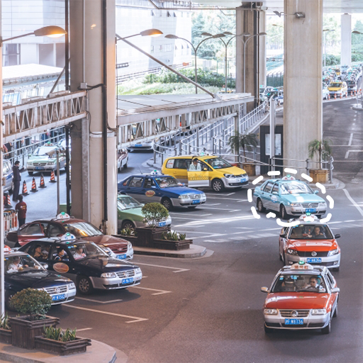
      </td>
      <td  width=18%> 
        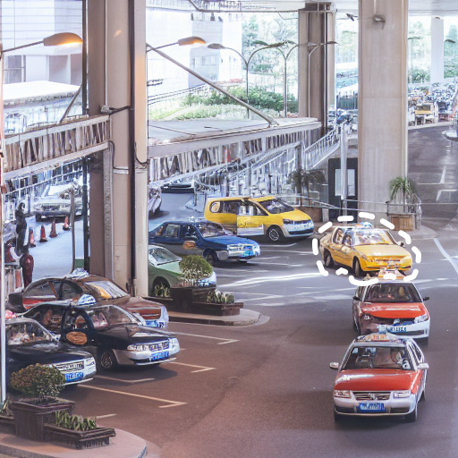
      </td>
      <td   width=18%>
        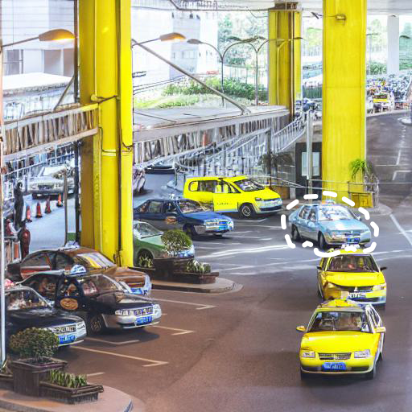
      </td>          
      <td  width=18%>
        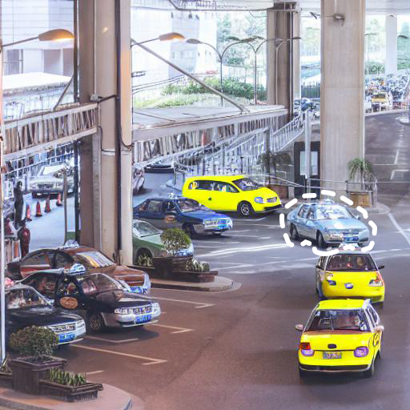</img>
      </td>
      <td width=18%>
        
      </td>    
    </tr>
    <tr>
      <td   width=10%>
        Plaid <br>Sofa
      </td>
      <td   width=15%>
        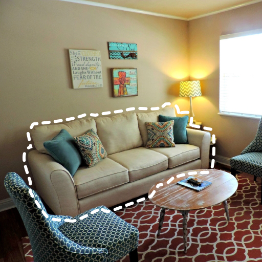
      </td>
      <td  width=15%> 
        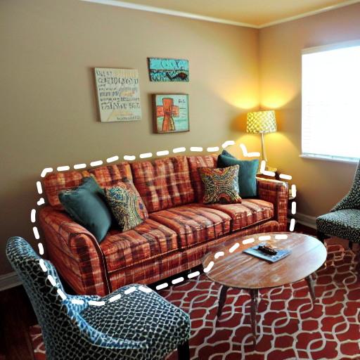
      </td>
      <td   width=15%>
        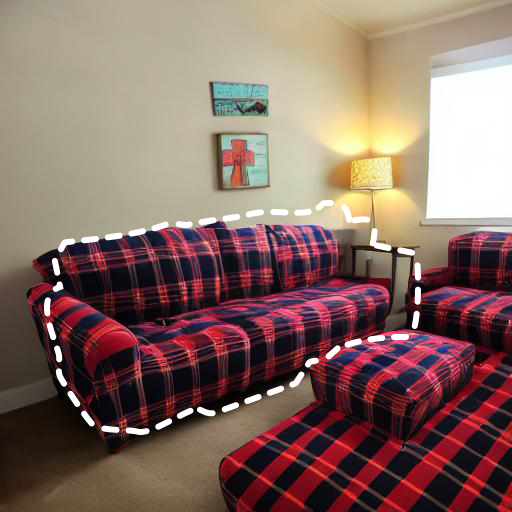
      </td>          
      <td  width=15%>
        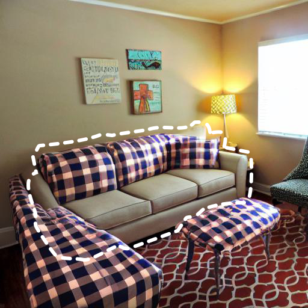</img>
      </td>
      <td width=15%>
        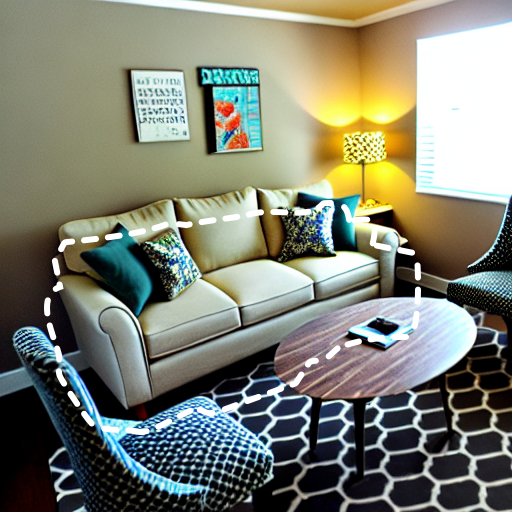
      </td> 
    </tr>   
    <tr>
      <td   width=10%>
        Tropical <br>fish
      </td>
      <td   width=18%>
        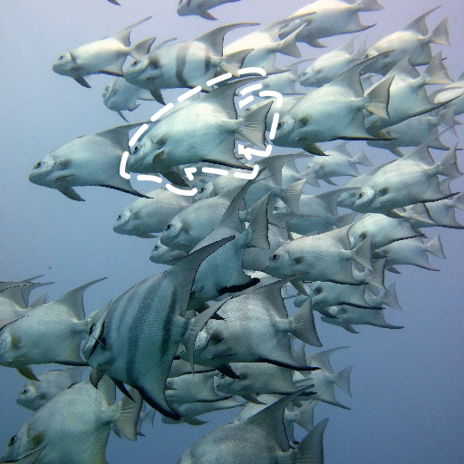
      </td>
      <td  width=18%> 
        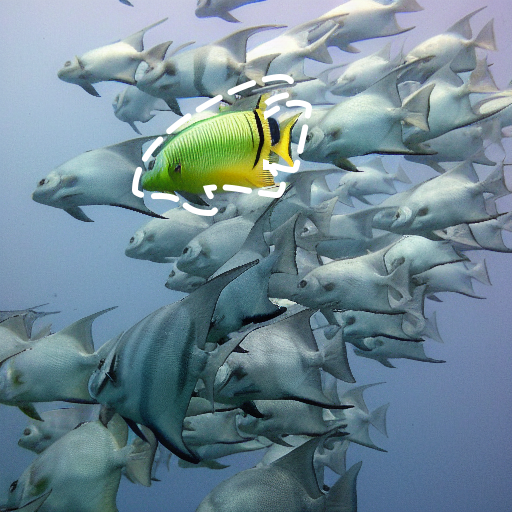
      </td>
      <td   width=18%>
        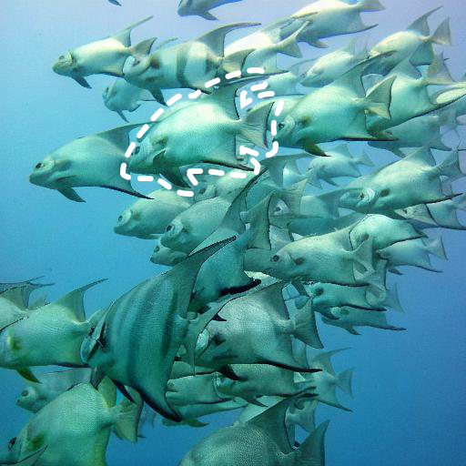
      </td>          
      <td  width=18%>
        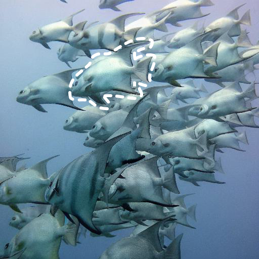</img>
      </td>
      <td width=18%>
        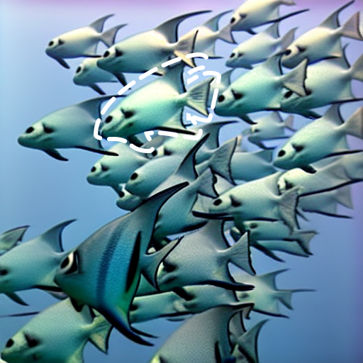
      </td>    
    </tr>
    <tr>
        <td   width=10%>
        Straw<br>-berry
      </td>
      <td   width=18%>
        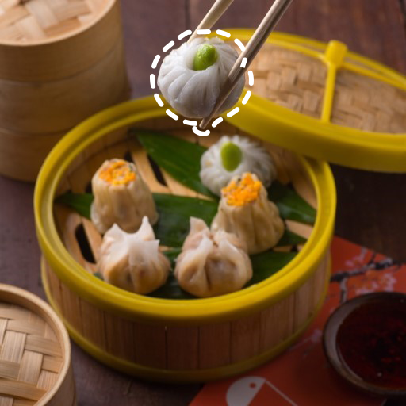
      </td>
      <td  width=18%> 
        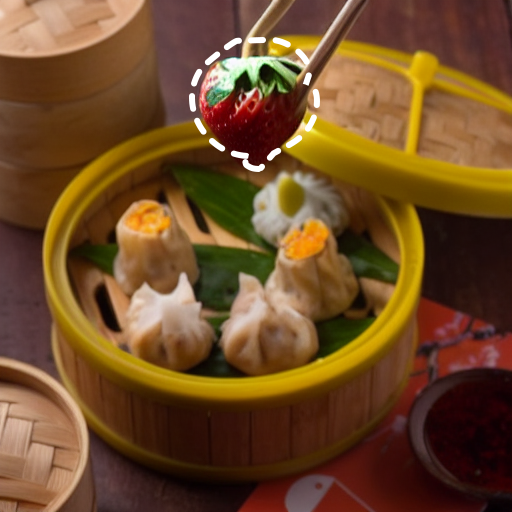
      </td>
      <td   width=18%>
        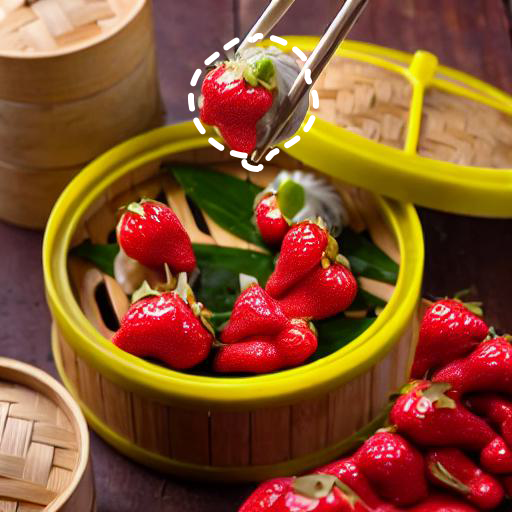
      </td>          
      <td  width=18%>
        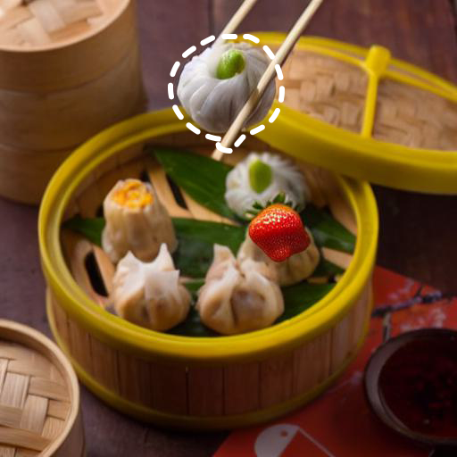</img>
      </td>
      <td width=18%>
        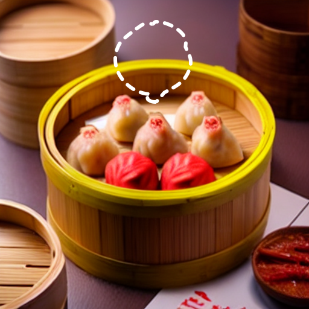
      </td>          
    </tr>
  </table>


<font size=4>Comparison with Inversion methods</font>

<p align="center">
  <table align="center"  >
    <tr >
      <td  style="text-align:center;" width=10% >
       Simplified <br>Prompt
      </td>
      <td  style="text-align:center;" width=15%>
       Source <br> Image
      </td>
      <td   style="text-align:center;"  width=15%>
        <b>Ours</b>
      </td>
      <td  style="text-align:center;"  width=15%>
       <a href="https://github.com/sen-mao/StyleDiffusion">Style<br>-Diffusion</a>
      </td>
      <td  style="text-align:center;"  width=15%>
      <a href="https://github.com/phymhan/prompt-to-prompt">ProxNPI</a>
      </td>
      <td  style="text-align:center;"  width=15%>
      <a href="https://github.com/cure-lab/DirectInversion">DirectInversion</a>
      </td>
    </tr>
    <tr>
      <td   width=10%>
        Jeep
      </td>
      <td   width=18%>
        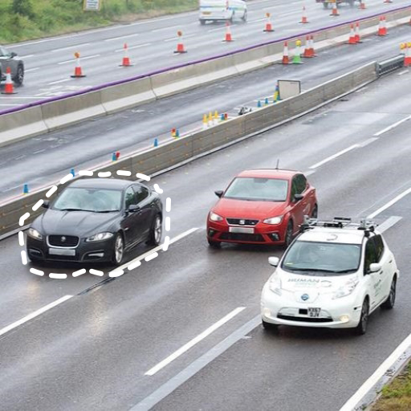
      </td>
      <td  width=18%> 
        
      </td>
      <td   width=18%>
        
      </td>          
      <td  width=18%>
        </img>
      </td>
      <td width=18%>
        
      </td>    
    </tr>
    <tr>
       <td   width=10%>
        Floral <br>sofa
      </td>
      <td   width=18%>
        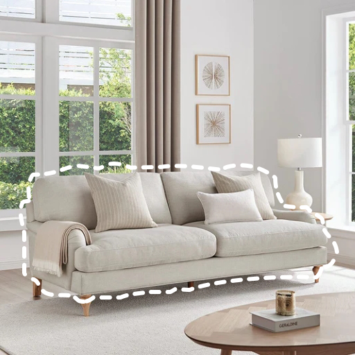
      </td>
      <td  width=18%> 
        
      </td>
      <td   width=18%>
        
      </td>          
      <td  width=18%>
        </img>
      </td>
      <td width=18%>
        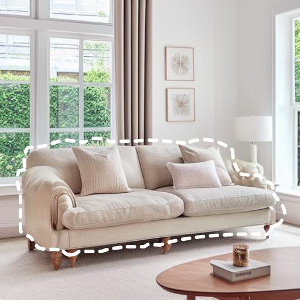
      </td>    
    </tr>   
    <tr>
      <td   width=10%>
        Yellow <br>shirt
      </td>
      <td   width=18%>
        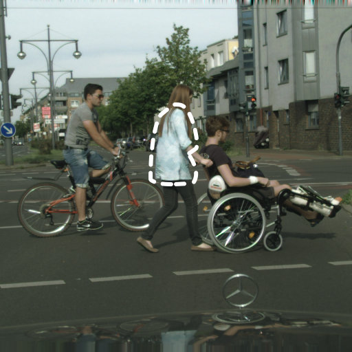
      </td>
      <td  width=18%> 
        
      </td>
      <td   width=18%>
        
      </td>          
      <td  width=18%>
        </img>
      </td>
      <td width=18%>
        
      </td>    
    </tr>
  </table>


## :triangular_flag_on_post: Citation 

```
@article{mao2023magedit,
      title={MAG-Edit: Localized Image Editing in Complex Scenarios via $\underline{M}$ask-Based $\underline{A}$ttention-Adjusted $\underline{G}$uidance}, 
      author={Qi Mao and Lan Chen and Yuchao Gu and Zhen Fang and Mike Zheng Shou},
      year={2023},
      journal={arXiv preprint arXiv:2312.11396},
}
``` 


## :revolving_hearts: Acknowledgements

This repository borrows heavily from [prompt-to-prompt](https://github.com/google/prompt-to-prompt/) and [layout-guidance](https://github.com/silent-chen/layout-guidance). Thanks to the authors for sharing their code and models.


