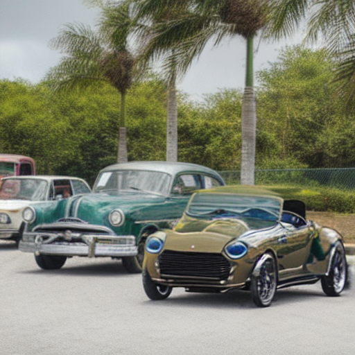

# MAG-Edit

This repository is the official implementation of MAG-Edit.

MAG-Edit: Localized Image Editing in Complex Scenarios via
Mask-Based Attention-Adjusted Guidance  

  
 
<em>Given a source image, a source prompt, an edited prompt and a mask as input, our method, MAG-Edit, generates an image that aligns with the edited prompt in the masked region.</em>

 

## TODO:
- [ ] Release Code
- [ ] Release MAG-Bench

## Results

### Various Editing Scenarios

<table class="center">
 <tr>
  <td style="text-align:center;" colspan="4"><b>Indoor Scenario</b></td>
</tr>
<tr>
  <td style="text-align:center;"><b>Input Image</b></td>
  <td style="text-align:center;" colspan="3"><b>Output Image</b></td>
</tr>
<tr>
  <td></td>
  <td></td>
  <td></td>              
  <td></td>
</tr>
<tr>
  <td width=25% style="text-align:center;color:gray;"></td>
  <td width=25% style="text-align:center;">"Blue and velvet sofa”</td>
  <td width=25% style="text-align:center;">"Marble table"</td>
  <td width=25% style="text-align:center;">"Yellow and damask carpet"</td>
</tr>
 <tr>
  <td style="text-align:center;" colspan="4"><b>Outdoor Scenario</b></td>
</tr>
<tr>
  <td style="text-align:center;"><b>Input Image</b></td>
  <td style="text-align:center;" colspan="3"><b>Output Image</b></td>
</tr>
<tr>
  <td></td>
  <td></td>
  <td></td>              
  <td></td>
</tr>
<tr>
  <td width=25% style="text-align:center;color:gray;"></td>
  <td width=25% style="text-align:center;">"Pirate hat”</td>
  <td width=25% style="text-align:center;">"Tall chef hat"</td>
  <td width=25% style="text-align:center;">"Leaves-covered grass"</td>
</tr>
<tr>
  <td></td>
  <td></td>
  <td></td>              
  <td></td>
</tr>
<tr>
  <td width=25% style="text-align:center;color:gray;"></td>
  <td width=25% style="text-align:center;">"Limousine”</td>
  <td width=25% style="text-align:center;">"Roadster"</td>
  <td width=25% style="text-align:center;">"Graffiti"</td>
</tr>

### Various Editing Types

  

### Controllable Granularity  Localized Editing  

## MAG-Bench

## Citation