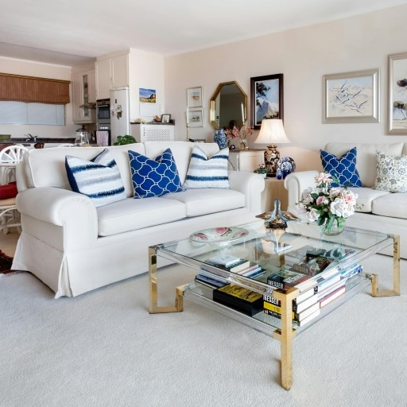
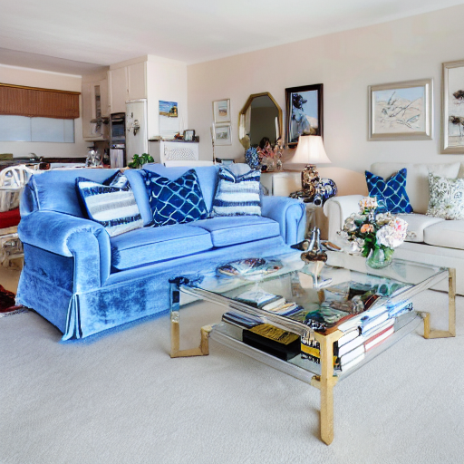
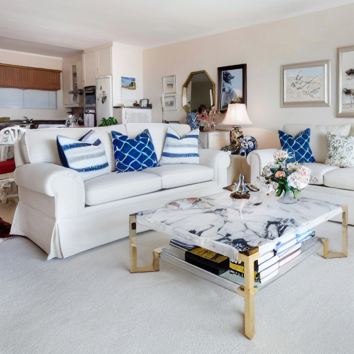
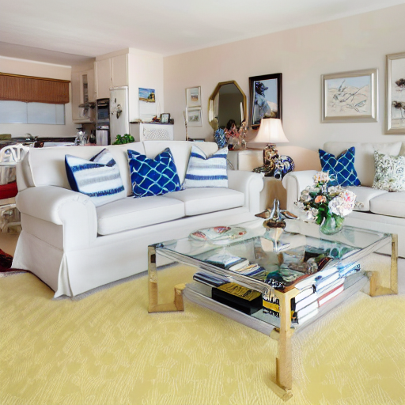
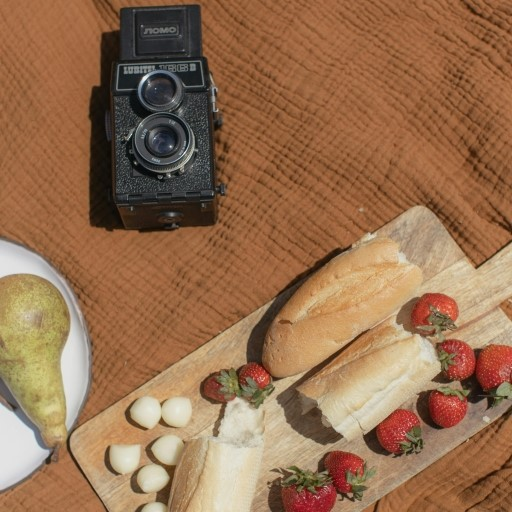
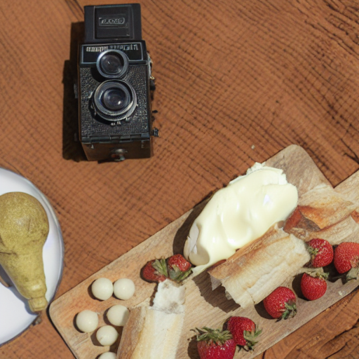
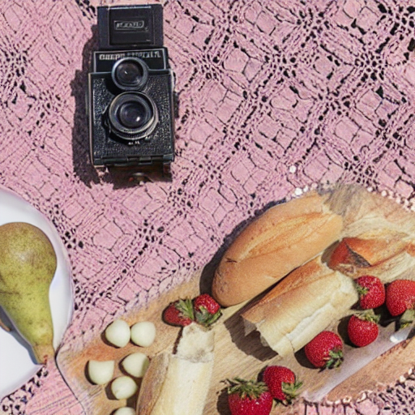
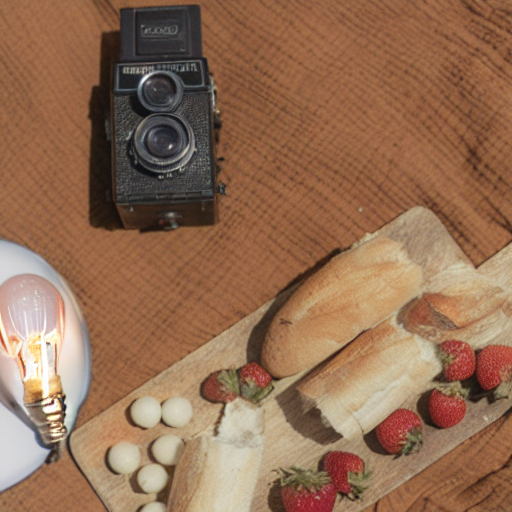
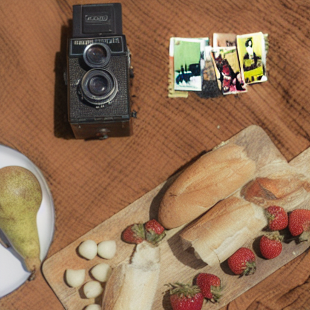
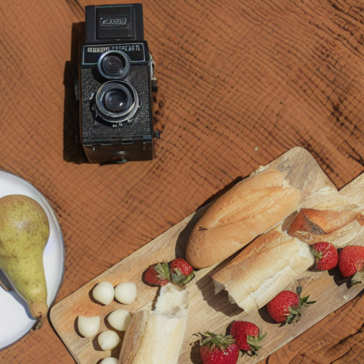

<h1> MAG-Edit </h1>

This repository is the official implementation of MAG-Edit.

MAG-Edit: Localized Image Editing in Complex Scenarios via
Mask-Based Attention-Adjusted Guidance  

[Qi Mao](https://sites.google.com/view/qi-mao/),  
[Lan Chen](), 
[Yuchao Gu](https://ycgu.site/), 
[Zhen Fang](),
[Wynne Hsu](https://www.comp.nus.edu.sg/~whsu/), 
[Mike Zheng Shou](https://sites.google.com/view/showlab)
 

  
 
<em>Given a source image, a source prompt, an edited prompt and a mask as input, our method, MAG-Edit, generates an image that aligns with the edited prompt in the masked region.</em>

## TODO:

- [ ] Release Code
- [ ] Release MAG-Edit paper and project page

<h2> Results </h2>

<h3> Various Editing Scenarios </h3>

  

<!--

  <table  align="center" border="1" width="100%" style="max-width: auto; text-align:center; margin: auto">
    <tr>
      <td width="160px" style="vertical-align:middle;text-align:center;" colspan="4"><b>Indoor Scenario</b></td>
    </tr>
    <tr>
      <td  width="180px"style="vertical-align:middle;text-align:center;color:grey;">Input Image</td>
      <td  width="180px"  style="vertical-align:middle;text-align:center;color:grey;" colspan="3">Output Image</td>
    </tr>
    <tr>
      <td  width="150px" align="center" style="vertical-align:middle;"></td>
      <td   width="150px" align="center"></td>
      <td  width="150px" align="center"></td>              
      <td  width="150px" align="center"></td>
    </tr>
    <tr>
      <td  style="vertical-align:middle;text-align:center;color:grey;">Simplified edited prompt</td>
      <td  style="vertical-align:middle;text-align:center;"><b>Blue and velvet</b> sofa</td>
      <td  style="vertical-align:middle;text-align:center;"><b>Marble</b> table</td>
      <td style="vertical-align:middle;text-align:center;"><b>Yellow and damask</b> carpet</td>
    </tr>
    <tr>
      <td style="vertical-align:middle;text-align:center;" colspan="4"><b>Outdoor Scenario</b></td>
    </tr>
    <tr>
      <td style="text-align:center;color:grey;">Input Image</td>
      <td style="text-align:center;color:grey;" colspan="3">Output Image</td>
    </tr>
    <tr>
      <td align="center"></td>
      <td align="center"></td>
      <td align="center"></td>              
      <td align="center"></td>
    </tr>
    <tr>
      <td  style="vertical-align:middle;text-align:center;color:gray;">Simplified edited prompt</td>
      <td  style="vertical-align:middle;text-align:center;"><b>Pirate hat</b></td>
      <td  style="vertical-align:middle;text-align:center;"><b>Tall chef hat</b></td>
      <td  style="vertical-align:middle;text-align:center;"><b>Leaves-covered</b> grass</td>
    </tr>
    <tr>
      <td align="center"></td>
      <td align="center"></td>
      <td align="center"></td>              
      <td align="center"></td>
    </tr>
    <tr>
      <td style="vertical-align:middle;text-align:center;color:gray;">Simplified edited prompt</td>
      <td  style="vertical-align:middle;text-align:center;"><b>Limousine</b></td>
      <td style="vertical-align:middle;text-align:center;"><b>Jeep</b></td>
      <td  style="vertical-align:middle;text-align:center;"><b>With graffiti</b></td>
    </tr>
  </table>
  

-->

<h3> Various Editing Types </h3>

  

<!--
  <table align="center" border="1" width="100%" style="max-width: 650px; text-align:center; margin:0 auto">
    <tr>
      <td width="120px" style="vertical-align:middle;text-align:center;color:grey;">Editing Type</td>
      <td  width="120px" style="vertical-align:middle;text-align:center;color:grey;"colspan="2">Object Attribute Manipulation</td>
      <td  width="120px" style="vertical-align:middle;text-align:center;color:grey;">Object Replacement</td>
      <td  width="120px" style="vertical-align:middle;text-align:center;color:grey;">Object Addition</td>
      <td  width="120px" style="vertical-align:middle;text-align:center;color:grey;">Object Removal</td>
    </tr>
    <tr>
      <td width="120px" style="vertical-align:middle;" align="center"></td>
      <td width="120px" style="vertical-align:middle;" align="center"></td>
      <td width="120px" style="vertical-align:middle;" align="center"></td>          
      <td width="120px" style="vertical-align:middle;" align="center"></td>
      <td width="120px" style="vertical-align:middle;" align="center"></td>
      <td width="120px" style="vertical-align:middle;" align="center"></td>
    </tr>
    <tr>
      <td  style="vertical-align:middle;text-align:center;color:grey;font-size=5px;">Simplified edited prompt</td>
      <td  style="vertical-align:middle;text-align:center;font-size=5px;"><b>Colorful</b> sheet</td>
      <td  style="vertical-align:middle;text-align:center;font-size=5px;"><b>Red Wine</b></td>
      <td style="vertical-align:middle;text-align:center;font-size=5px;"><b>Bowl</b></td>
      <td style="vertical-align:middle;text-align:center;font-size=5px;"><b>Blue butterfly</b></td>
      <td style="vertical-align:middle;text-align:center;font-size=5px;">Remove a <b>lemon</b></td>      
    </tr>
    <tr>
      <td style="vertical-align:middle;" align="center"></td>
      <td style="vertical-align:middle;" align="center"></td>
      <td style="vertical-align:middle;" align="center"></td>              
      <td style="vertical-align:middle;" align="center"></td>
      <td style="vertical-align:middle;" align="center"></td>
      <td style="vertical-align:middle;" align="center"></td>
    </tr>
    <tr>
      <td  style="vertical-align:middle;text-align:center;color:grey;">Simplified edited prompt</td>
      <td  style="vertical-align:middle;text-align:center;"><b>Wooden house</b></td>
      <td  style="vertical-align:middle;text-align:center;"><b>Lit window</b></td>
      <td style="vertical-align:middle;text-align:center;"><b>Jack-O'-Lantern</b></td>
      <td style="vertical-align:middle;text-align:center;"><b>Curtained</b> window</td>
      <td style="vertical-align:middle;text-align:center;">Remove a <b>flag</b></td>      
    </tr> 
    <tr>
      <td style="vertical-align:middle;" align="center"></td>
      <td style="vertical-align:middle;" align="center"></td>
      <td style="vertical-align:middle;" align="center"></td>              
      <td style="vertical-align:middle;" align="center"></td>
      <td style="vertical-align:middle;" align="center"></td>
      <td style="vertical-align:middle;" align="center"></td>
    </tr>
    <tr>
      <td  style="vertical-align:middle;text-align:center;color:grey;">Simplified edited prompt</td>
      <td  style="vertical-align:middle;text-align:center;"><b>Creamy</b> bread</td>
      <td  style="vertical-align:middle;text-align:center;"><b>Pink and lace sheet</b></td>
      <td style="vertical-align:middle;text-align:center;"><b>Light bulb</b></td>
      <td style="vertical-align:middle;text-align:center;"><b>Polaroid photos</b>
</td>
      <td style="vertical-align:middle;text-align:center;">Remove a <b>strawberry</b></td>      
    </tr>  
  </table>
-->

<h3> Other Applications</h3>  

  
 

<h2> Citation </h2>

